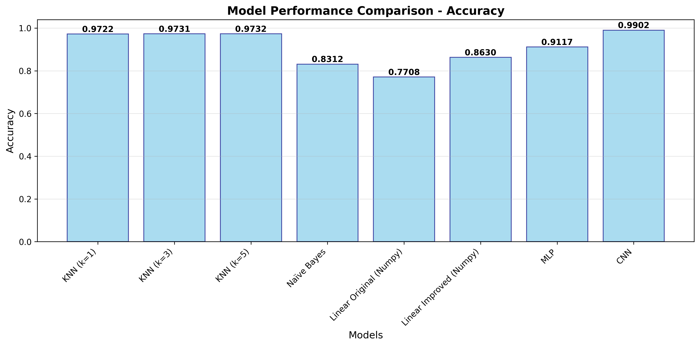
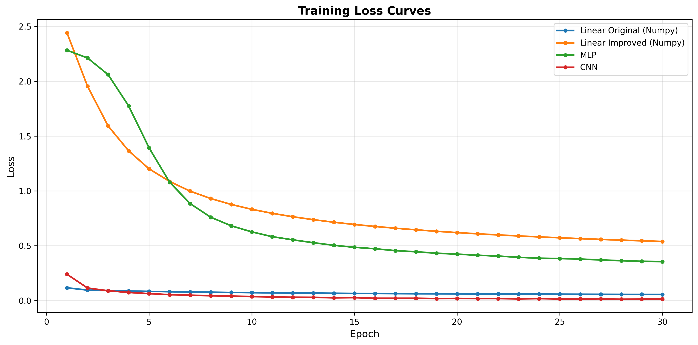
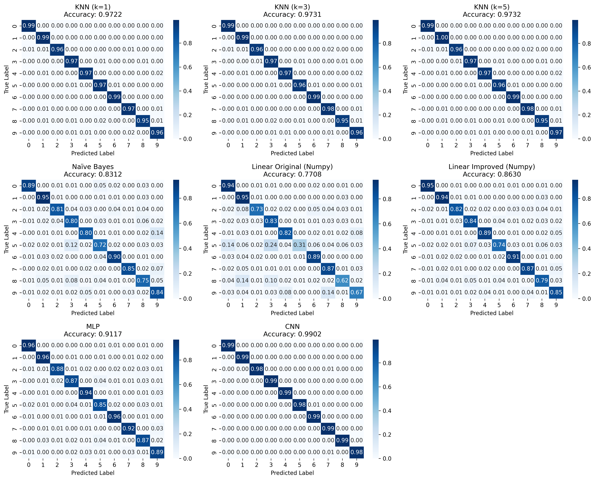
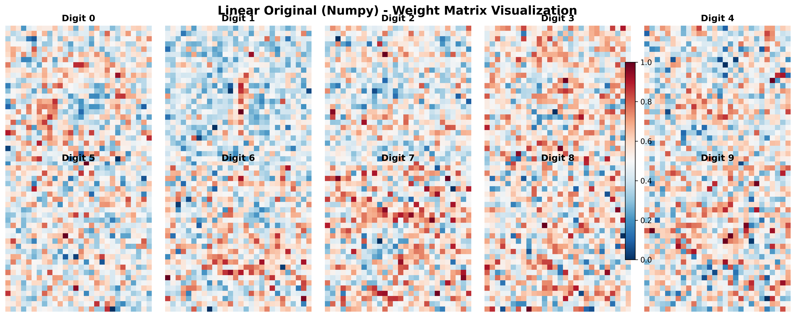
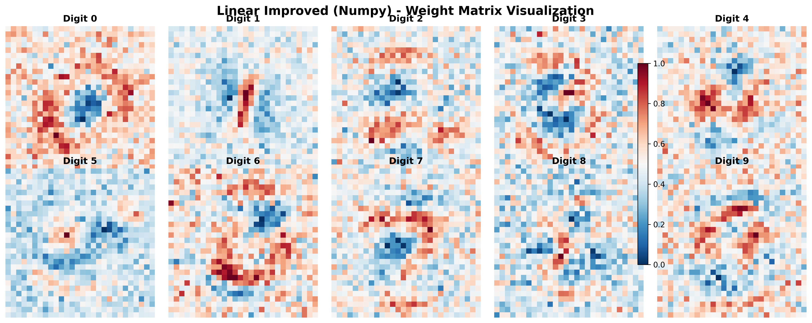
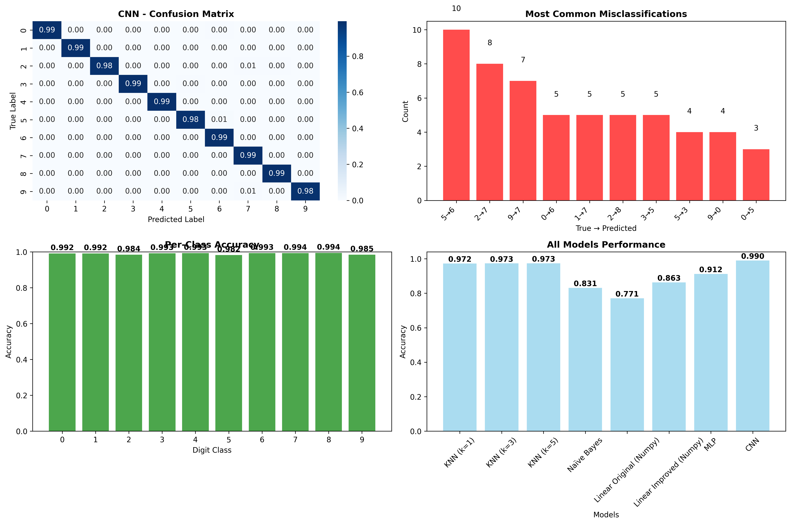
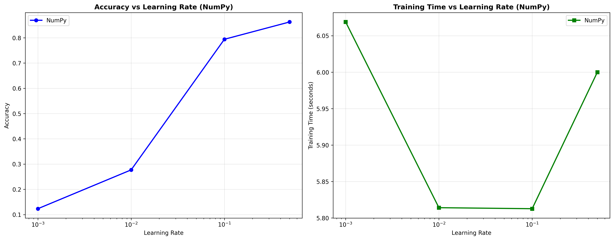
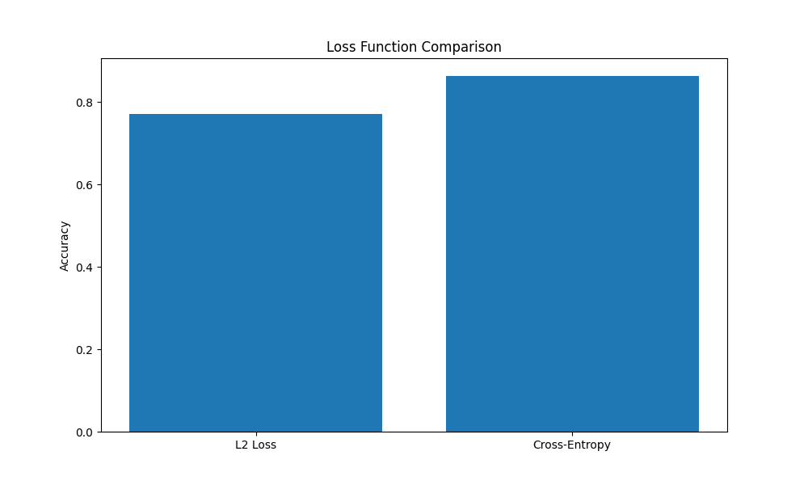
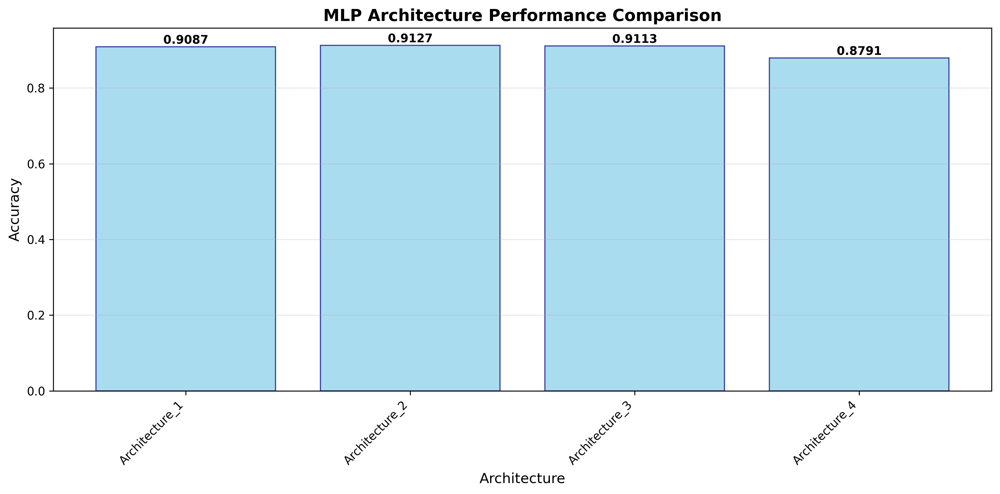

# MNIST Digit Classification Project

A machine learning project that implements and compares multiple classification algorithms on the MNIST handwritten digit dataset. This project demonstrates various approaches from simple linear classifiers to deep neural networks, with detailed performance analysis and visualizations.

## Project Overview

This project implements 6 different machine learning algorithms to classify handwritten digits (0-9) from the MNIST dataset:

- **K-Nearest Neighbors (KNN)** - Instance-based learning
- **Naive Bayes** - Probabilistic classifier  
- **Linear Classifier (Original)** - Basic linear model with L2 loss
- **Linear Classifier (Improved)** - Enhanced linear model with cross-entropy loss
- **Multi-Layer Perceptron (MLP)** - Feedforward neural network
- **Convolutional Neural Network (CNN)** - Deep learning approach

## Results Summary

| Model | Accuracy | Precision | Recall | F1-Score | Training Time | Prediction Time |
|-------|----------|-----------|--------|----------|---------------|-----------------|
| **CNN** | **99.02%** | 99.03% | 99.02% | 99.03% | 461.10s | 2.23s |
| **KNN (k=5)** | **97.32%** | 97.35% | 97.32% | 97.32% | 0.02s | 673.31s |
| **MLP** | **91.17%** | 91.15% | 91.17% | 91.14% | 40.77s | 0.03s |
| **Linear Improved** | **86.30%** | 86.29% | 86.30% | 86.23% | 6.97s | 0.03s |
| **Naive Bayes** | **83.12%** | 83.42% | 83.12% | 83.14% | 0.03s | 84.54s |
| **Linear Original** | **77.08%** | 78.29% | 77.08% | 75.87% | 5.85s | 0.03s |

## Project Structure

```
Project1/
├── src/
│   ├── classifiers/          # Implementation of all ML algorithms
│   │   ├── cnn_classifier.py
│   │   ├── knn_classifier.py
│   │   ├── linear_classifier.py
│   │   ├── linear_classifer_improved.py
│   │   ├── mlp_classifier.py
│   │   └── naive_bayes_classifier.py
│   ├── evaluation/          # Performance evaluation and comparisons
│   │   ├── evaluation.py
│   │   └── comparisons.py
│   ├── utils/              # Data loading utilities
│   │   └── data_loader.py
│   └── visualization/      # Plotting and visualization
│       └── visualizations.py
├── config/                 # Configuration settings
│   └── config.py
├── data/                   # MNIST dataset (60,000 training + 10,000 test images)
│   └── MNIST/
├── results/               # Generated results and reports
│   ├── plots/            # Visualization outputs
│   └── reports/          # Detailed performance reports
├── main.py               # Main execution script
└── requirements.txt      # Python dependencies
```

## Quick Start

### Prerequisites

- Python 3.8 or higher
- CUDA-compatible GPU (optional, for CNN acceleration)

### Installation

1. **Clone the repository:**
   ```bash
   git clone <repository-url>
   cd Project1
   ```

2. **Create virtual environment:**
   ```bash
   python -m venv venv
   source venv/bin/activate  # On Windows: venv\Scripts\activate
   ```

3. **Install dependencies:**
   ```bash
   pip install -r requirements.txt
   ```

4. **Run the complete evaluation:**
   ```bash
   python main.py
   ```

## Dataset Information

- **MNIST Dataset**: 60,000 handwritten digit images (28×28 pixels)
- **Training Set**: 48,000 images
- **Test Set**: 12,00 images
- **Classes**: 10 digits (0-9)
- **Preprocessing**: Normalized pixel values to [0,1] range

## Configuration

Key parameters can be modified in `config/config.py`:

- Learning rates for different algorithms
- Training epochs and batch sizes
- Model architectures
- Data preprocessing options

## Detailed Analysis

### Algorithm Implementations

#### 1. **Linear Classifiers**
- **Original**: Basic implementation with L2 loss and random weight initialization
- **Improved**: Enhanced with cross-entropy loss, Xavier initialization, and optimized learning rate (0.5)
- **Improvement**: 11.96% accuracy boost (77.08% → 86.30%)

#### 2. **K-Nearest Neighbors**
- Tested with k values: 1, 3, 5
- Best performance: k=5 (97.32% accuracy)
- Fast training but slow prediction due to distance calculations

#### 3. **Multi-Layer Perceptron**
- Architecture comparison: [128], [256,128], [512,256,128], [256,256,128,64]
- Best architecture: [256, 128] (91.28% accuracy)
- ReLU activation, Adam optimizer

#### 4. **Convolutional Neural Network**
- 2D convolutional layers with max pooling
- Batch normalization and dropout for regularization
- Highest accuracy: 99.02%

#### 5. **Naive Bayes**
- Gaussian Naive Bayes on binarized images
- Fast training and prediction
- Good baseline performance: 83.12%

### Performance Insights

#### **Speed vs Accuracy Trade-offs:**
- **Fastest Training**: KNN (0.02s) - No training required
- **Fastest Prediction**: Linear models (0.03s) - Simple matrix operations
- **Best Accuracy**: CNN (99.02%) - Deep feature learning
- **Best Balance**: MLP (91.17% accuracy, reasonable training time)

#### **Key Findings:**
1. **Cross-entropy loss** significantly outperforms L2 loss for classification
2. **Proper initialization** (Xavier) improves convergence
3. **Learning rate optimization** (0.5) enhances linear classifier performance
4. **Architecture depth** has diminishing returns beyond [256, 128] for MLP
5. **Convolutional layers** are essential for near-perfect digit recognition

## Visualizations Generated

The project generates comprehensive visualizations in `results/plots/`:

### Model Comparison Chart
Accuracy comparison across all algorithms:


### Training Curves
Loss and accuracy over training epochs:


### Confusion Matrices
Per-class performance analysis:


### Weight Visualizations
Learned feature maps for linear classifiers:

**Linear Original:**


**Linear Improved:**


### Failure Analysis
Misclassified examples and error patterns:


### Algorithm-Specific Comparisons

**Learning Rate Comparison:**


**Loss Function Comparison:**


**MLP Architecture Comparison:**


## Generated Reports

Detailed reports are saved in `results/reports/`:

- Individual model reports (e.g., `cnn.txt`, `mlp.txt`). The individual reports might have +-2% difference in accuracy compared to the comprehensive report, as it was done in different runs.

## References

1. **Code Implementation Sources**

   - [KNN Implementation](https://machinelearningmastery.com/tutorial-to-implement-k-nearest-neighbors-in-python-from-scratch/)
   - [Neural Network Tutorial](https://towardsdatascience.com/how-to-build-your-own-neural-network-from-scratch-in-python-68998a08e4f6)
   - [CNN with PyTorch](https://pytorch.org/tutorials/beginner/blitz/cifar10_tutorial.html)
   - [Naive Bayes Implementation](https://machinelearningmastery.com/naive-bayes-classifier-scratch-python/) 

2. **Visualization Tools**
   - [Matplotlib Tutorials](https://matplotlib.org/stable/tutorials/)
   - [Seaborn Gallery](https://seaborn.pydata.org/examples/) 
